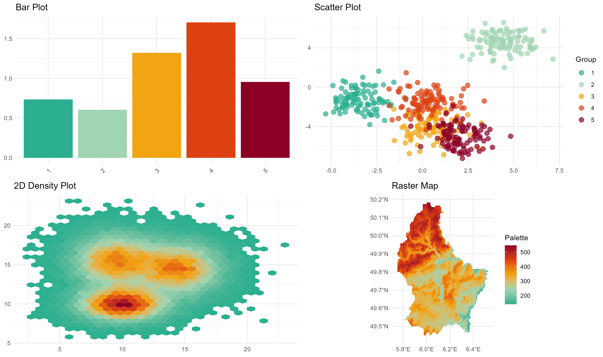
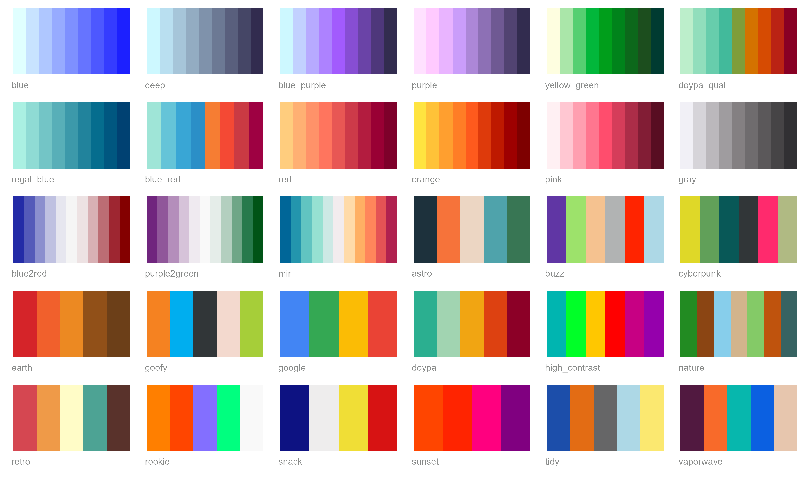

<!-- README.md is generated from README.Rmd. Please edit that file -->

# DOYPAColors <a href="https://jmestret.github.io/DOYPAColors/"></a>

<!-- badges: start -->

[](https://cran.r-project.org/package=DOYPAColors)
[](https://github.com/jmestret/DOYPAColors/actions/workflows/R-CMD-check.yaml)
[](https://app.codecov.io/gh/jmestret/DOYPAColors?branch=main)
<!-- badges: end -->

## Overview

Tired of agonizing over color choices for your data visualizations? Let
**DOYPAColors** do the heavy lifting for you! Our R package provides a
delightful array of color palettes, each meticulously crafted to enhance
your plots. With **DOYPAColors**, you can even let us surprise you with
a palette choice, so you can focus on what matters most—telling your
data’s unique story. Say goodbye to color selection headaches and hello
to vibrant, eye-catching visuals! 🎨

## Installation

To install **DOYPAColors** from CRAN, use:

``` r
install.packages("DOYPAColors")
```

For the development version from GitHub, use:

``` r
if (!require("devtools")) {
  install.packages("devtools")
}

devtools::install_github("jmestret/DOYPAColors")
```

## How to use

Using **DOYPAColors** is straightforward. Access and utilize our
palettes in your R plots with a single line of code:

``` r
library(DOYPAColors)
color_palette <- doypa()
```

You can then apply these palettes to your `ggplot2` plots using the
functions `scale_fill_doypa()` and `scale_color_doypa()`:

``` r
library(ggplot2)

# Create a bar plot with a DOYPAColors palette
ggplot(iris, aes(x = Species, y = Sepal.Length, fill = Species)) +
    geom_boxplot() +
    scale_fill_doypa(discrete = TRUE) +
    theme_classic()
```

You can explore how specific palettes fit different types of data using
the `preview_pal()` function:

``` r
preview_pal("doypa")
```

<p align="center">

</p>

### Available palettes

Here’s a visualization of all available palettes in **DOYPAColors**:

<p align="center">

</p>

For more advanced usage and options, check out our
[web](https://jmestret.github.io/DOYPAColors/) to get the most out of
**DOYPAColors** palettes!

## Contributing

We welcome contributions from the community! If you have a new color
palette you’d like to share, we’d be thrilled to consider it for
inclusion in **DOYPAColors**. To submit your palette:

1.  Provide a name for your palette.
2.  Specify the type of palette (sequential, diverging, or qualitative).
3.  List the HEX color codes for your palette.

You can submit your palette details by opening an issue or a pull
request on our [GitHub
repository](https://github.com/jmestret/DOYPAColors). We will review
your submission and, if it meets our criteria, we’ll be glad to include
it in the package!

## How to cite

If you use **DOYPAColors**, please reference the R package as follows:

Jorge Mestre (2023). DOYPAColors: Don’t Overthink Your Palette of
Colors. R package version 0.0.2,
<https://cran.r-project.org/web/packages/DOYPAColors>
