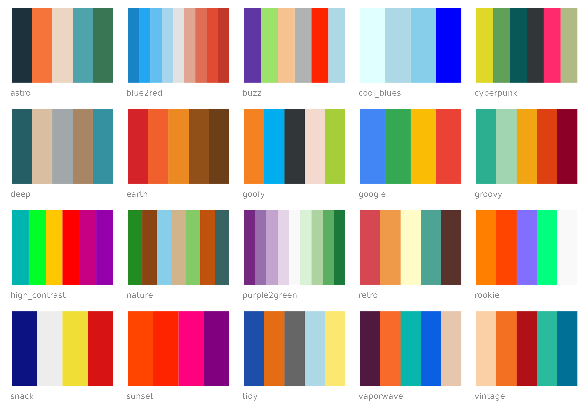
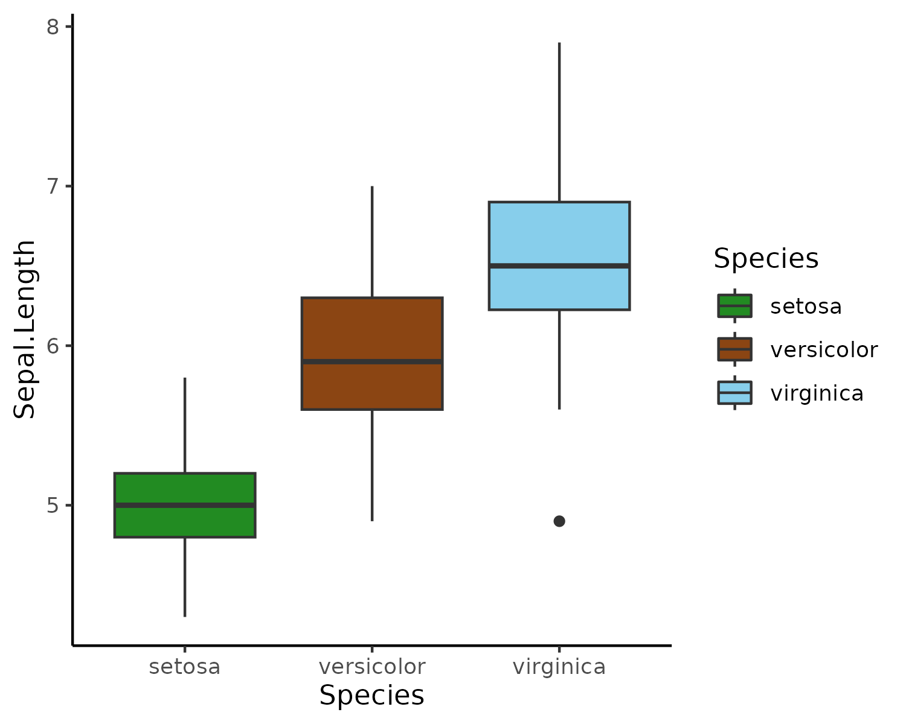
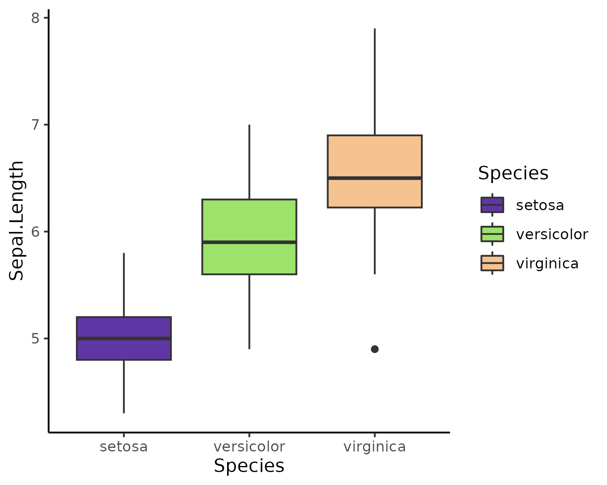
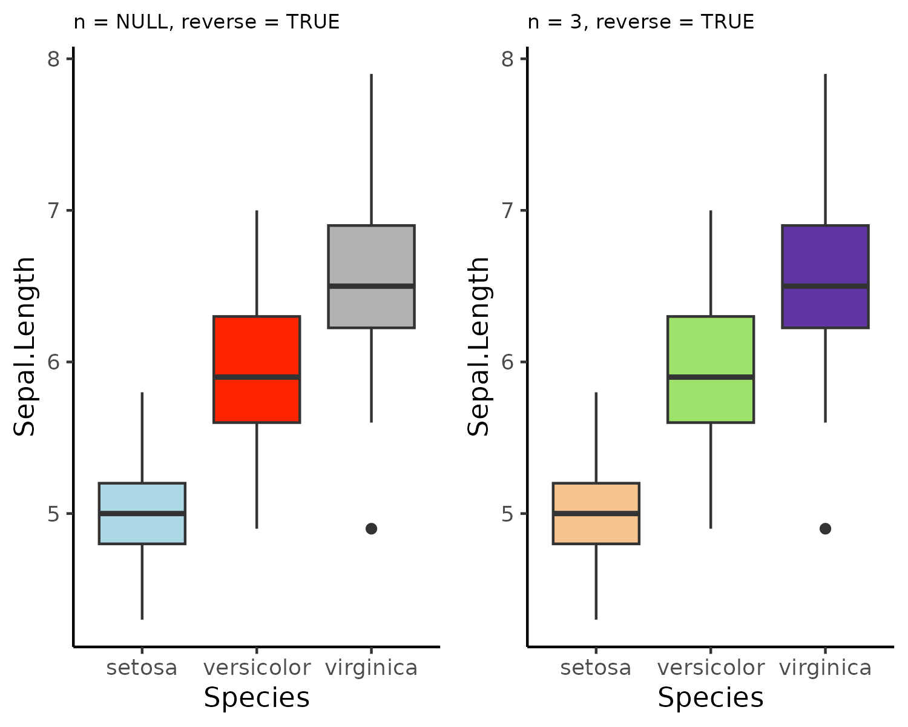
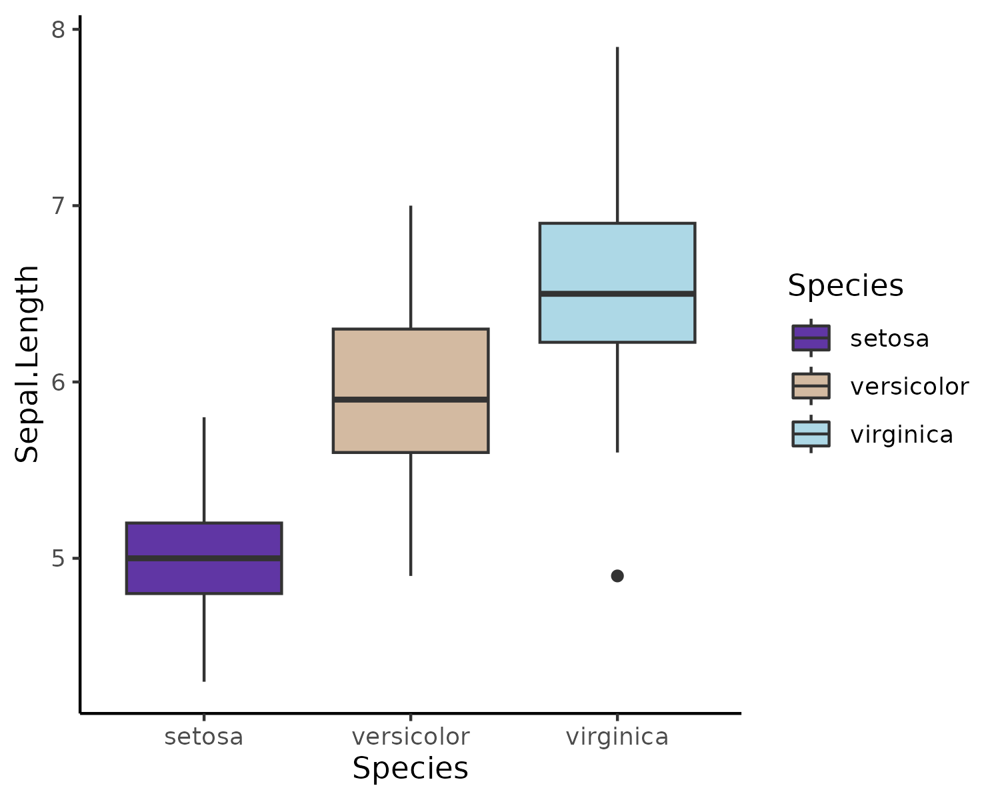

# DOYPAColors - Don't Overthink Your Palette of Colors 

[](https://cran.r-project.org/package=DOYPAColors)
[](https://github.com/metacran/cranlogs.app)
[](https://github.com/jmestret/DOYPAColors)
[](https://github.com/jmestret/DOYPAColors/stargazers)

***

Tired of agonizing over color choices for your data visualizations? Let DOYPAColors do the heavy lifting for you! Our R package offers a delightful array of color palettes, each meticulously crafted and ready to breathe life into your plots. We'll even surprise you with a palette choice, so you can focus on what matters most—telling your data's unique story. Say goodbye to color selection headaches and hello to vibrant, eye-catching visuals with **DOYPAColors** 🎨!


## Installation

You can install `DOYPAColors` from `CRAN` by:

```{r}
install.packages("DOYPAColors")
library(DOYPAColors)
```

or you can install the development version from this GitHub repository: 

```{r}
if (!require("devtools")) 
  install.packages("devtools")

devtools::install_github("jmestret/DOYPAColors")
library(DOYPAColors)
```

## How to use?

You can easily access and utilize the DOYPAColors palettes in your R plots with the following steps:

### Preview available palettes

To get a sneak peek at the available color palettes, you can use the `preview_doypa_pals()` function:

```{r}
preview_doypa_pals()
```



Additionally, you can simply list the names of the available palettes by running:

```{r}
list_doypa_pals()
```

### Applying palettes to your plots

Integrating DOYPAColors palettes into your plots is straightforward with the ggplot-style functions `scale_fill_doypa()` and `scale_color_doypa()`. By setting the `palette` argument, you can select your preferred palette, or leave it blank, and we'll choose one for you. You also have the option to control whether the color scale is discrete or continuous using the `discrete` argument:

```{r}
ggplot(iris, aes(x = Species, y = Sepal.Length, fill = Species)) +
    geom_boxplot() +
    scale_fill_doypa(discrete = TRUE) +
    theme_classic()
```
*We've handpicked the exciting 'nature' palette for you - no overthinking required!*

<p align="center">
  
</p>


With the `n` argument, you can specify how many colors to use in your plot:

```{r}
ggplot(iris, aes(x = Species, y = Sepal.Length, fill = Species)) +
    geom_boxplot() +
    scale_fill_doypa(palette = "buzz", n = 3, discrete = TRUE) +
    theme_classic()
```

<p align="center">
  
</p>

The reverse argument allows you to `reverse` the order of the color palette. You can experiment with the combination of `n` and `reverse` to control the reverse order for the entire palette or just the first `n` colors:

```{r}
p1 <- ggplot(iris, aes(x = Species, y = Sepal.Length, fill = Species)) +
    geom_boxplot() +
    scale_fill_doypa(palette = "buzz", reverse = TRUE, discrete = TRUE) +
    theme_classic() +
    theme(legend.position = "none") +
    ggtitle("n = NULL, reverse = TRUE")

p2 <- ggplot(iris, aes(x = Species, y = Sepal.Length, fill = Species)) +
    geom_boxplot() +
    scale_fill_doypa(palette = "buzz", n = 3, reverse = TRUE, discrete = TRUE) +
    theme_classic() +
    theme(legend.position = "none") +
    ggtitle("n = 3, reverse = TRUE")

ggpubr::ggarrange(p1, p2)
```

<p align="center">
  
</p>

For even more versatility, the `ramp` argument enables you to create a color ramp and interpolate colors from the chosen color palette:

```{r}
ggplot(iris, aes(x = Species, y = Sepal.Length, fill = Species)) +
    geom_boxplot() +
    scale_fill_doypa(palette = "buzz", ramp = TRUE, discrete = TRUE) +
    theme_classic()
```

<p align="center">
  
</p>

Feel free to explore the various combinations of arguments to discover all the captivating DOYPAColors palettes!

